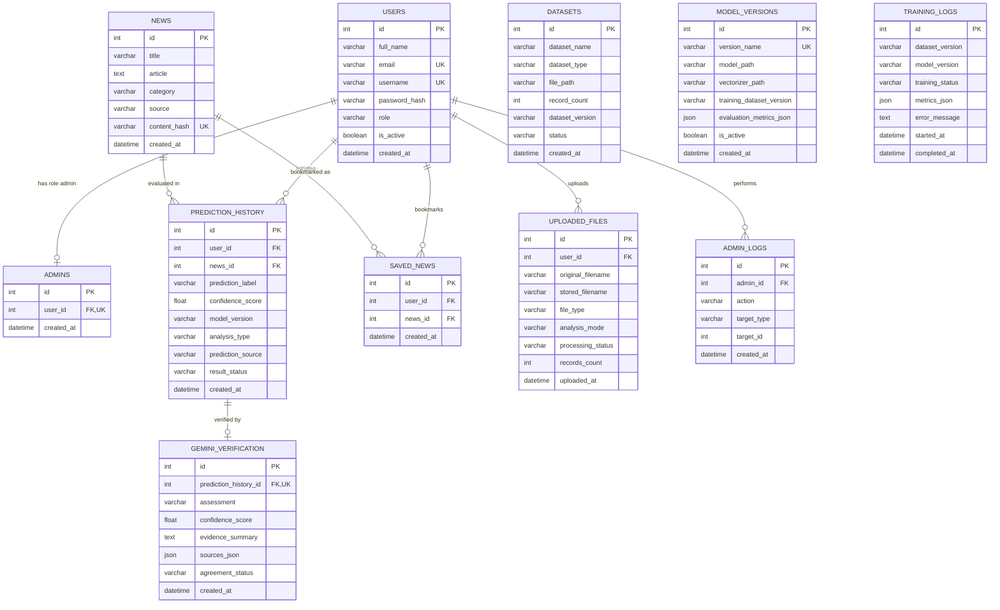

# Entity-Relationship (ER) Diagram

The relational database architecture is defined in MySQL 8.0+ and SQLAlchemy ORM with 11 normalized tables ensuring referential integrity and auditability.

```mermaid
erDiagram
    USERS ||--o| ADMINS : "has role admin"
    USERS ||--o{ PREDICTION_HISTORY : "initiates"
    USERS ||--o{ SAVED_NEWS : "bookmarks"
    USERS ||--o{ UPLOADED_FILES : "uploads"
    USERS ||--o{ ADMIN_LOGS : "performs"

    NEWS ||--o{ PREDICTION_HISTORY : "evaluated in"
    NEWS ||--o{ SAVED_NEWS : "bookmarked as"

    PREDICTION_HISTORY ||--o| GEMINI_VERIFICATION : "verified by"

    USERS {
        int id PK
        varchar full_name
        varchar email UK
        varchar username UK
        varchar password_hash
        varchar role
        boolean is_active
        datetime created_at
    }

    ADMINS {
        int id PK
        int user_id FK, UK
        datetime created_at
    }

    NEWS {
        int id PK
        varchar title
        text article
        varchar category
        varchar source
        varchar content_hash UK
        datetime created_at
    }

    PREDICTION_HISTORY {
        int id PK
        int user_id FK
        int news_id FK
        varchar prediction_label
        float confidence_score
        varchar model_version
        varchar analysis_type
        varchar prediction_source
        varchar result_status
        datetime created_at
    }

    SAVED_NEWS {
        int id PK
        int user_id FK
        int news_id FK
        datetime created_at
    }

    UPLOADED_FILES {
        int id PK
        int user_id FK
        varchar original_filename
        varchar stored_filename
        varchar file_type
        varchar analysis_mode
        varchar processing_status
        int records_count
        datetime uploaded_at
    }

    DATASETS {
        int id PK
        varchar dataset_name
        varchar dataset_type
        varchar file_path
        int record_count
        varchar dataset_version
        varchar status
        datetime created_at
    }

    GEMINI_VERIFICATION {
        int id PK
        int prediction_history_id FK, UK
        varchar assessment
        float confidence_score
        text evidence_summary
        json sources_json
        varchar agreement_status
        datetime created_at
    }

    MODEL_VERSIONS {
        int id PK
        varchar version_name UK
        varchar model_path
        varchar vectorizer_path
        varchar training_dataset_version
        json evaluation_metrics_json
        boolean is_active
        datetime created_at
    }

    TRAINING_LOGS {
        int id PK
        varchar dataset_version
        varchar model_version
        varchar training_status
        json metrics_json
        text error_message
        datetime started_at
        datetime completed_at
    }

    ADMIN_LOGS {
        int id PK
        int admin_id FK
        varchar action
        varchar target_type
        int target_id
        datetime created_at
    }
```
