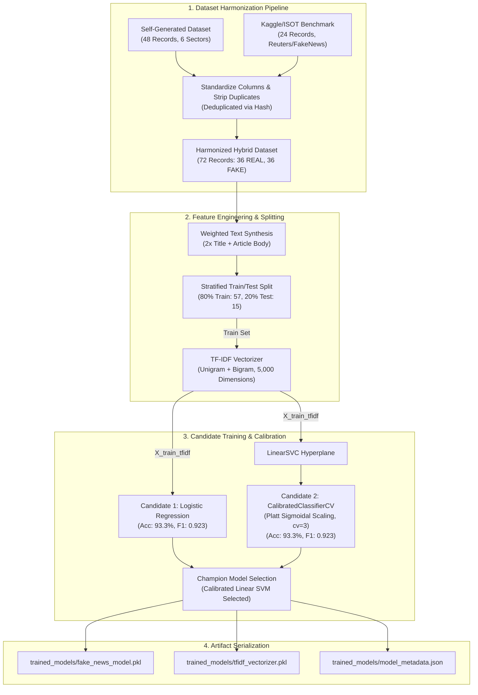

# Machine Learning Training & Inference Workflow Diagram

```mermaid
graph TD
    subgraph DatasetHarmonization ["1. Dataset Harmonization Pipeline"]
        D_Self["Self-Generated Dataset<br/>(48 Records, 6 Sectors)"]
        D_Kaggle["Kaggle/ISOT Benchmark<br/>(24 Records, Reuters/FakeNews)"]
        CleanMerge["Standardize Columns & Strip Duplicates<br/>(Deduplicated via Hash)"]
        D_Hybrid["Harmonized Hybrid Dataset<br/>(72 Records: 36 REAL, 36 FAKE)"]

        D_Self --> CleanMerge
        D_Kaggle --> CleanMerge
        CleanMerge --> D_Hybrid
    end

    subgraph FeatureEngineering ["2. Feature Engineering & Splitting"]
        Split["Stratified Train/Test Split<br/>(80% Train: 57, 20% Test: 15)"]
        Weighting["Weighted Text Synthesis<br/>(2x Title + Article Body)"]
        TFIDF["TF-IDF Vectorizer<br/>(Unigram + Bigram, 5,000 Dimensions)"]

        D_Hybrid --> Weighting
        Weighting --> Split
        Split -->|Train Set| TFIDF
    end

    subgraph ModelTraining ["3. Candidate Training & Calibration"]
        TFIDF -->|X_train_tfidf| LR["Candidate 1: Logistic Regression<br/>(Acc: 93.3%, F1: 0.923)"]
        TFIDF -->|X_train_tfidf| BaseSVM["LinearSVC Hyperplane"]
        BaseSVM --> Calibrator["Candidate 2: CalibratedClassifierCV<br/>(Platt Sigmoidal Scaling, cv=3)<br/>(Acc: 93.3%, F1: 0.923)"]

        LR --> Select["Champion Model Selection<br/>(Calibrated Linear SVM Selected)"]
        Calibrator --> Select
    end

    subgraph ArtifactSerialization ["4. Artifact Serialization"]
        Select --> PickleModel["trained_models/fake_news_model.pkl"]
        Select --> PickleVec["trained_models/tfidf_vectorizer.pkl"]
        Select --> JSONMeta["trained_models/model_metadata.json"]
    end
```
