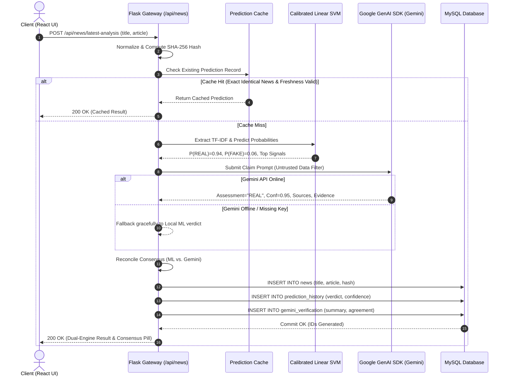

# Dual-Engine Sequence Diagram

Interaction sequence showing communication between React UI, Flask Backend, Local ML Pipeline, Google Gemini, and MySQL Relational Storage.

```mermaid
sequenceDiagram
    autonumber
    actor User as Client (React UI)
    participant Flask as Flask Gateway (/api/news)
    participant Cache as Prediction Cache
    participant ML as Calibrated Linear SVM
    participant Gemini as Google GenAI SDK (Gemini)
    participant DB as MySQL Database

    User->>Flask: POST /api/news/latest-analysis (title, article)
    Flask->>Flask: Normalize & Compute SHA-256 Hash
    Flask->>Cache: Check Existing Prediction Record
    alt Cache Hit (Exact Identical News & Freshness Valid)
        Cache-->>Flask: Return Cached Prediction
        Flask-->>User: 200 OK (Cached Result)
    else Cache Miss
        Flask->>ML: Extract TF-IDF & Predict Probabilities
        ML-->>Flask: P(REAL)=0.94, P(FAKE)=0.06, Top Signals
        Flask->>Gemini: Submit Claim Prompt (Untrusted Data Filter)
        alt Gemini API Online
            Gemini-->>Flask: Assessment="REAL", Conf=0.95, Sources, Evidence
        else Gemini Offline / Missing Key
            Flask-->>Flask: Fallback gracefully to Local ML verdict
        end
        Flask->>Flask: Reconcile Consensus (ML vs. Gemini)
        Flask->>DB: INSERT INTO news (title, article, hash)
        Flask->>DB: INSERT INTO prediction_history (verdict, confidence)
        Flask->>DB: INSERT INTO gemini_verification (summary, agreement)
        DB-->>Flask: Commit OK (IDs Generated)
        Flask-->>User: 200 OK (Dual-Engine Result & Consensus Pill)
    end
```
